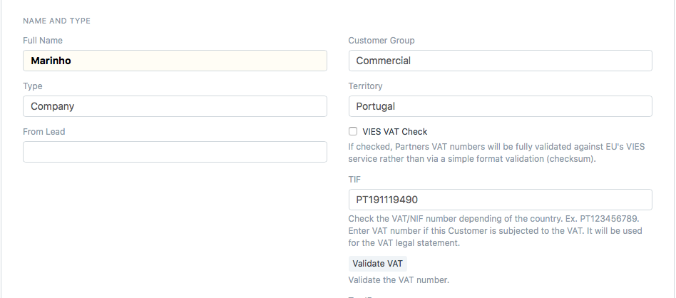
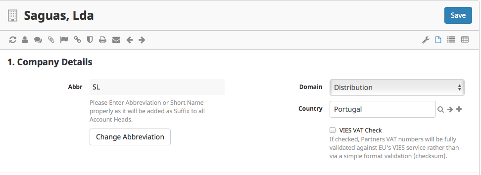

### Introduction

This is my fisrt application in frappe framework. I don't give ANY WARRANTY, but it works!!!.

I made this because it will be necessary in my country to operate, this and other things i intent to do for this framework.

I also made this to learn the frappe framework and don't double check neither the code and neither i was concerned with code presentation. So maybe the code is not too well structured.
Maybe another time with more time!!!

This app check if the VAT / NIF is correct. This app use module vatnumber to check the VAT for the particular country and optionaly will be fully validated against EU's VIES service.

This is un adaptation from this work: [https://github.com/odoo/odoo/tree/master/addons/base_vat](https://github.com/odoo/odoo/tree/master/addons/base_vat)

### Depends on
- frappe/erpnext (To install: [bench page](https://github.com/frappe/bench) )
- python module vatnumber (First do <i>bench shell</i> and then <i>easy_install vatnumber or pip install vatnumber</i>.)

### Instalation

bench get-app base_vat [https://github.com/saguas/frappe_base_vat.git](https://github.com/saguas/frappe_base_vat.git)
 

### How to:

# enter vat number

After install, this module provide a text box on the customer to enter the vat number.
Just enter the vat (TIF) number. Optionally click Validate VAT button to quickly (client side and before save) check if the number is valid.
Either way, the number will be checked on the server before save to database. 

# enforce check against EU's VIES service
If your company want that the vat number would be checked against [EU's VIES service] (http://ec.europa.eu/taxation_customs/taxation/vat/traders/vat_number/index_en.htm), then you must enforce that, clicking on the check box in that company document (Setup->Masters->Company).

### From another app

If you need check the vat number on your own module, just call the whitelist function <i>validate_vat</i> (PATH: base_vat.vat.vat_validation.validate_vat) and pass the vat number and company name as arguments. See Customer Script (Customer-Client) <i>validate_vat</i> function.

### Frappe Framework

For details and documentation, see the website

[https://frappe.io](https://frappe.io)